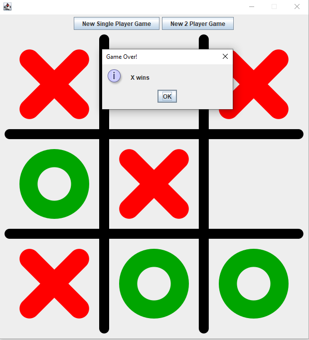
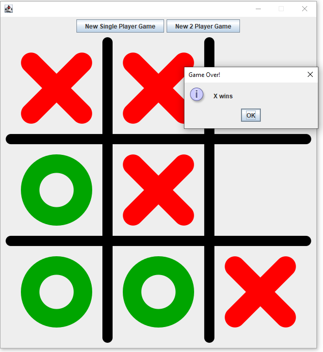

# Project Title 🚩

TicTacToe project.

## Description 📃📃

This project is about implementing simple code, creating an old classic game.

## Getting Started

### First step

- Clone or download this project by pressing green code button.

### Executing program 🚀🚀

- To run this project just open Main.java and press green "run icon". (IntelliJ).

## Demo 💻

## Author 👨‍👩‍👧‍👦

Ovidijus Eitminavicius